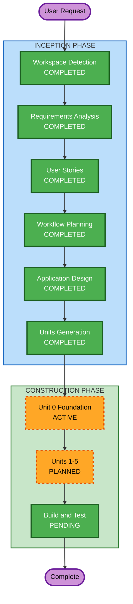

# Execution Plan — BigBatch

## Detailed Analysis Summary

### Change Impact Assessment

- **User-facing changes**: Yes — the current delivery is now web-first, and the web foundation must present a polished Mantine-based UI baseline.
- **Structural changes**: Yes — active construction now centers on `apps/web`, `apps/api`, and `packages/shared`; Expo/mobile is removed from the active workspace.
- **Data model changes**: No new entities are introduced by this scope update; the existing multi-household domain model remains valid.
- **API changes**: No contract change is required for this update; the API remains client-agnostic for future native apps.
- **NFR impact**: Yes — web UX requirements increase, maintainability improves through a narrower active scope, and SECURITY/PBT rules remain fully enforced.

### Risk Assessment

- **Risk Level**: Medium — scope changed during construction and the web shell is being migrated to a new design system, but the active platform count has been reduced.
- **Rollback Complexity**: Moderate — docs, workspace configuration, and the web foundation move together.
- **Testing Complexity**: Moderate — the revised foundation still needs build, typecheck, and test coverage across the active workspace.

## Workflow Visualization



### Text Alternative

```text
INCEPTION PHASE:
  1. Workspace Detection      — COMPLETED
  2. Reverse Engineering      — SKIPPED (greenfield)
  3. Requirements Analysis    — COMPLETED
  4. User Stories             — COMPLETED
  5. Workflow Planning        — COMPLETED
  6. Application Design       — COMPLETED
  7. Units Generation         — COMPLETED

CONSTRUCTION PHASE:
  8. Unit 0 Foundation        — ACTIVE (web-first Mantine rebaseline)
  9. Units 1-5                — PLANNED
  10. Build and Test          — PENDING

OPERATIONS PHASE:
  11. Operations              — PLACEHOLDER
```

## Phases to Execute

### INCEPTION PHASE

- [x] Workspace Detection (COMPLETED)
- [x] Reverse Engineering — SKIPPED (greenfield)
- [x] Requirements Analysis (COMPLETED)
- [x] User Stories (COMPLETED)
- [x] Workflow Planning (COMPLETED)
- [x] Application Design (COMPLETED)
- [x] Units Generation (COMPLETED)

### CONSTRUCTION PHASE

- [x] Unit 0 Functional Design (COMPLETED)
- [ ] Unit 0 Code Generation Rebaseline — EXECUTE
  - **Rationale**: Align the generated foundation with the revised scope by removing active mobile delivery and establishing a Mantine-based web shell.
- [ ] Units 1-5 — EXECUTE
  - **Rationale**: Continue the domain roadmap across the active packages (`apps/web`, `apps/api`, `packages/shared`).
- [ ] Build and Test — EXECUTE (ALWAYS)
  - **Rationale**: Verify the revised foundation and all later units using the existing build, typecheck, and test commands.

### OPERATIONS PHASE

- [ ] Operations — PLACEHOLDER
  - **Rationale**: Future deployment and monitoring workflows

## Stages Skipped

- **Reverse Engineering** — greenfield project, no existing code
- **Active mobile app construction** — intentionally deferred; future mobile work will use fully native clients in a later phase

## Success Criteria

- **Primary Goal**: Working BigBatch web app + API deployed to cloud with household support and a polished Mantine-based web foundation
- **Key Deliverables**: Monorepo with `apps/web`, `apps/api`, `packages/shared`; future-native-ready REST API; full SECURITY and PBT coverage for the active codebase
- **Quality Gates**: All active workspace changes build cleanly, typecheck cleanly, and maintain SECURITY/PBT expectations
