# Execution Plan — BigBatch

## Detailed Analysis Summary

### Change Impact Assessment

- **User-facing changes**: Yes — all features are user-facing across web and mobile
- **Structural changes**: Yes — greenfield; entire architecture to be created
- **Data model changes**: Yes — recipes, ingredients, users, households, shopping lists, cook events
- **API changes**: Yes — full REST API to be designed and built
- **NFR impact**: Yes — full security baseline (15 rules) and PBT (10 rules) enforced

### Risk Assessment

- **Risk Level**: Medium — well-scoped domain but multiple platforms (web + mobile + API), self-managed auth, and two extension rulesets as blocking constraints
- **Rollback Complexity**: Easy — greenfield, nothing to break
- **Testing Complexity**: Moderate — PBT enforcement requires property identification and generator design for every unit

## Workflow Visualization

```mermaid
flowchart TD
    Start(["User Request"])

    subgraph INCEPTION["INCEPTION PHASE"]
        WD["Workspace Detection\nCOMPLETED"]
        RA["Requirements Analysis\nCOMPLETED"]
        US["User Stories\nCOMPLETED"]
        WP["Workflow Planning\nIN PROGRESS"]
        AD["Application Design\nEXECUTE"]
        UG["Units Generation\nEXECUTE"]
    end

    subgraph CONSTRUCTION["CONSTRUCTION PHASE"]
        direction TB
        LOOP["Per-Unit Loop"]
        FD["Functional Design\nEXECUTE"]
        NFRA["NFR Requirements\nEXECUTE"]
        NFRD["NFR Design\nEXECUTE"]
        ID["Infrastructure Design\nEXECUTE"]
        CG["Code Generation\nEXECUTE"]
        BT["Build and Test\nEXECUTE"]
    end

    Start --> WD --> RA --> US --> WP --> AD --> UG
    UG --> LOOP --> FD --> NFRA --> NFRD --> ID --> CG
    CG -->|"next unit"| LOOP
    CG -->|"all units done"| BT
    BT --> End(["Complete"])

    style WD fill:#4CAF50,stroke:#1B5E20,stroke-width:3px,color:#fff
    style RA fill:#4CAF50,stroke:#1B5E20,stroke-width:3px,color:#fff
    style US fill:#4CAF50,stroke:#1B5E20,stroke-width:3px,color:#fff
    style WP fill:#4CAF50,stroke:#1B5E20,stroke-width:3px,color:#fff
    style AD fill:#FFA726,stroke:#E65100,stroke-width:3px,stroke-dasharray: 5 5,color:#000
    style UG fill:#FFA726,stroke:#E65100,stroke-width:3px,stroke-dasharray: 5 5,color:#000
    style FD fill:#FFA726,stroke:#E65100,stroke-width:3px,stroke-dasharray: 5 5,color:#000
    style NFRA fill:#FFA726,stroke:#E65100,stroke-width:3px,stroke-dasharray: 5 5,color:#000
    style NFRD fill:#FFA726,stroke:#E65100,stroke-width:3px,stroke-dasharray: 5 5,color:#000
    style ID fill:#FFA726,stroke:#E65100,stroke-width:3px,stroke-dasharray: 5 5,color:#000
    style CG fill:#4CAF50,stroke:#1B5E20,stroke-width:3px,color:#fff
    style BT fill:#4CAF50,stroke:#1B5E20,stroke-width:3px,color:#fff
    style LOOP fill:#FFA726,stroke:#E65100,stroke-width:3px,stroke-dasharray: 5 5,color:#000
    style Start fill:#CE93D8,stroke:#6A1B9A,stroke-width:3px,color:#000
    style End fill:#CE93D8,stroke:#6A1B9A,stroke-width:3px,color:#000
    style INCEPTION fill:#BBDEFB,stroke:#1565C0,stroke-width:2px
    style CONSTRUCTION fill:#C8E6C9,stroke:#2E7D32,stroke-width:2px
    linkStyle default stroke:#333,stroke-width:2px
```



### Text Alternative

```
INCEPTION PHASE:
  1. Workspace Detection      — COMPLETED
  2. Reverse Engineering       — SKIPPED (greenfield)
  3. Requirements Analysis     — COMPLETED
  4. User Stories              — COMPLETED
  5. Workflow Planning         — IN PROGRESS
  6. Application Design        — EXECUTE
  7. Units Generation          — EXECUTE

CONSTRUCTION PHASE (per unit):
  8. Functional Design         — EXECUTE
  9. NFR Requirements          — EXECUTE
  10. NFR Design               — EXECUTE
  11. Infrastructure Design    — EXECUTE
  12. Code Generation          — EXECUTE (always)
  13. Build and Test           — EXECUTE (always, after all units)

OPERATIONS PHASE:
  14. Operations               — PLACEHOLDER
```

## Phases to Execute

### INCEPTION PHASE

- [x] Workspace Detection (COMPLETED)
- [x] Reverse Engineering — SKIPPED (greenfield)
- [x] Requirements Analysis (COMPLETED)
- [x] User Stories (COMPLETED)
- [x] Workflow Planning (IN PROGRESS)
- [ ] Application Design — EXECUTE
  - **Rationale**: New system; need to define components, domain model, service boundaries, API surface, and household auth architecture before implementation
- [ ] Units Generation — EXECUTE
  - **Rationale**: 4 deployable artifacts (web, mobile, API, shared package) each needing independent design-through-code cycles

### CONSTRUCTION PHASE (per unit)

- [ ] Functional Design — EXECUTE
  - **Rationale**: New data models (recipes, ingredients, households, shopping lists, cook events); complex business logic (scaling with rounding, nutrition calculation, shopping list consolidation); PBT-01 requires property identification during design
- [ ] NFR Requirements — EXECUTE
  - **Rationale**: Full security baseline (SECURITY-01 through SECURITY-15) and PBT (PBT-01 through PBT-10) are blocking constraints that need explicit assessment per unit
- [ ] NFR Design — EXECUTE
  - **Rationale**: Security patterns (auth middleware, CORS, rate limiting, input validation, session management) and PBT framework setup need design before code generation
- [ ] Infrastructure Design — EXECUTE
  - **Rationale**: Turso (managed SQLite), Cloudflare Pages, PaaS for API — cloud resources need specification for SECURITY-01, SECURITY-02, SECURITY-07 compliance
- [ ] Code Generation — EXECUTE (ALWAYS)
  - **Rationale**: Implementation required for all units
- [ ] Build and Test — EXECUTE (ALWAYS)
  - **Rationale**: Build verification, PBT test execution with seed logging (PBT-08), CI integration

### OPERATIONS PHASE

- [ ] Operations — PLACEHOLDER
  - **Rationale**: Future deployment and monitoring workflows

## Stages Skipped

- **Reverse Engineering** — greenfield project, no existing code

## Success Criteria

- **Primary Goal**: Working BigBatch app (web + mobile + API) deployed to cloud with household support
- **Key Deliverables**: Monorepo with apps/web, apps/mobile, apps/api, packages/shared; all 28 user stories implemented; full test suite including PBT
- **Quality Gates**: All SECURITY rules compliant; all PBT rules compliant; all acceptance criteria from stories verified
